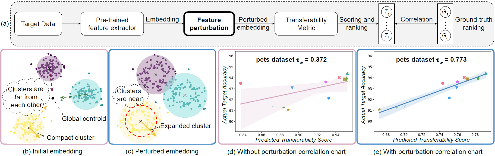

# Enhancing Transferability Estimation

Leveraging a transferability estimation metric facilitates the non-trivial challenge of selecting the optimal model for the downstream task from a pool of pre-trained models. Most existing metrics primarily focus on identifying the statistical relationship between feature embeddings and the corresponding labels within the target dataset, but overlook crucial aspect of model robustness. This oversight may limit their effectiveness in accurately ranking pre-trained models. To address this limitation, we introduce a feature perturbation method that enhances the transferability estimation process by systematically altering the feature space. Our method includes a Spread operation that increases intra-class variability, adding complexity within classes, and an Attract operation that minimizes the distances between different classes, thereby blurring the class boundaries. Through extensive experimentation, we demonstrate the efficacy of our feature perturbation method in providing a more precise and robust estimation of model transferability. Notably, the existing LogMe method exhibited a significant improvement, showing a **28.84%** increase in performance after applying our feature perturbation method.

## Visual Overview

Below is an illustration of our feature perturbation method for enhancing transferability estimation:



- **(a)** Flowchart outlining the transferability estimation enhancement process, with bold elements representing our **Spread** and **Attract** perturbation steps.
- **(b)** Initial embeddings showing strong inter-class separation and compact intra-class clustering, typical in supervised models.
- **(c)** Embeddings after applying our **Spread** and **Attract** perturbation method. Notice the increased intra-class variability and blurred inter-class boundaries.
- **(d)** and **(e)** Actual correlation charts on the pets dataset, depicting the model ranking predictions before and after perturbations. Each symbol represents a model, and the charts highlight the shift to higher correlation values after applying our perturbation method, demonstrating improved accuracy in model ranking.

## Requirements

- PyTorch version 1.9.0
- torchvision version 0.10.0
- CUDA version 11.1

To install the required packages, run the following command:

```bash
conda install pytorch==1.9.0 torchvision==0.10.0 cudatoolkit=11.1 -c pytorch
pip install timm==0.4.9
```


## Data Preparation

Download the downstream datasets to `../data/*`.

## Model Checkpoints

Download the model checkpoints to `./models/*`.

## Pipeline of Model Selection using Transferability

### Step 1 (optional): Fine-tune pre-trained models with hyper-parameter sweep to obtain ground-truth transferability score

```bash
python finetune_group1.py -m resnet50 -d cifar10
```

### Step 2: Extract features of target data using pre-trained models

```bash
python forward_feature_group1.py -d cifar10
```

### Step 3: Evaluate the transferability of models

```bash
python evaluate_metric_group1_cpu.py -me SA -d cifar10 --type NCTI 
```

### Step 4: Calculate the ranking correlation

```bash
python tw_group1.py --me SA --type NCTI -d sun397
```

### Acknowledgement:

This code repository is developed based on SFDA.
